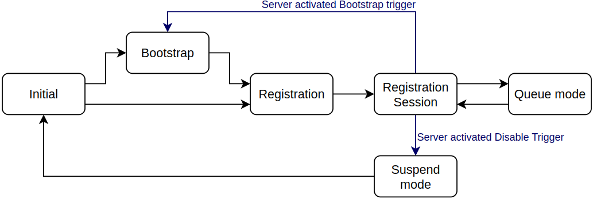
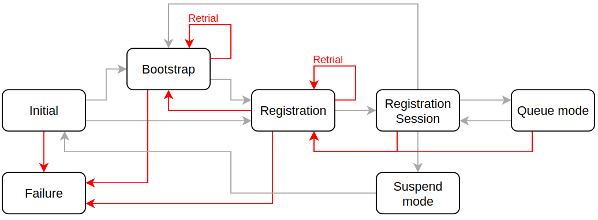
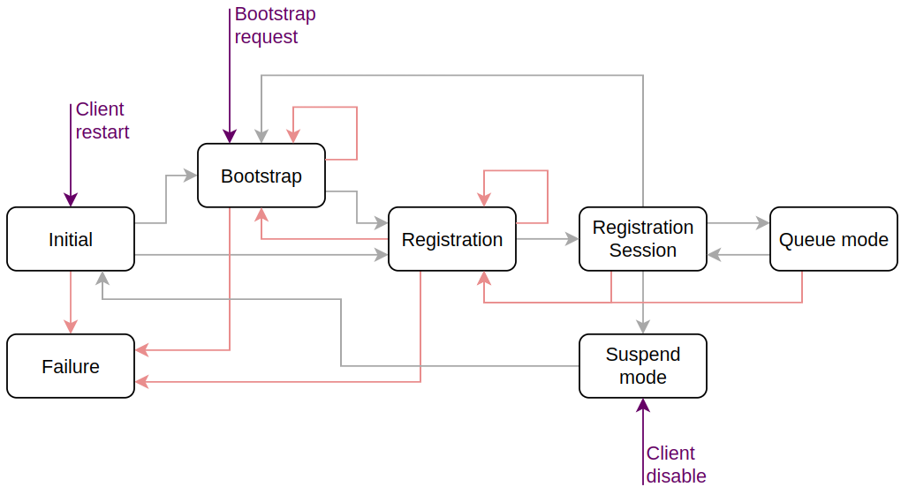

..
   Copyright 2023-2025 AVSystem <avsystem@avsystem.com>
   AVSystem Anjay Lite LwM2M SDK
   All rights reserved.

   Licensed under AVSystem Anjay Lite LwM2M Client SDK - Non-Commercial License.
   See the attached LICENSE file for details.

LwM2M Client Logic
===================

The following document describes the state machine of the LwM2M client in Anjay Lite.
It outlines the state transitions and error handling logic, providing a comprehensive
overview of the client lifecycle. The state machine is designed to handle various scenarios,
including bootstrap, registration session, and user-triggered actions.

State machine overview
^^^^^^^^^^^^^^^^^^^^^^

The state machine consists of several states, each with specific responsibilities and transitions.
In addition to the basic connection states, there are also intermediate states that are beyond the scope of this tutorial, e.g.
`ANJ_CONN_STATUS_INVALID`. For a complete list and descriptions, refer to the `anj_conn_status_t` for more information.
The following diagram illustrates the state transitions, without error handling:

**Initial:**

* The client always starts in the **Initial** state.
* Validates the presence of LwM2M Security and Server object instances.
* If only an LwM2M Bootstrap-Server instance of Security object is present (resource BootstrapServer `0/x/1` is True), transitions to the **Bootstrap** state.
* If an LwM2M Server instance is available within the Security object and has a corresponding Server object instance, transitions to the **Registration** state.

**Bootstrap:**

* Starts by reading and validating the LwM2M Bootstrap-Server instance of the Security object.
* Opens a connection to the LwM2M Bootstrap Server.
* Sends a `Bootstrap-Request` message.
* Awaits LwM2M Bootstrap Server configuration requests.
* After receiving `Bootstrap-Finish` message, connection is closed and the client transitions to the **Registration** state.

**Registration:**

* Reads and validates the corresponding Server and Security object instances.
* Opens a connection to the LwM2M Server.
* Sends a `Register` request.
* Upon receiving a valid response, transitions to the **Registration Session** state.
* At the start of each new registration session, all existing observations and pending send requests are cleared.

**Registration Session:**

* Handles incoming server requests.
* Monitors time to the next `Update` message and sends it based on the calculated timeout.

  * The timeout for sending the next `Update` message is calculated using the following formula: ``MAX(lifetime/2,lifetime - MAX_TRANSMIT_WAIT)``
  * `MAX_TRANSMIT_WAIT` is a CoAP-defined transmission parameter that represents the maximum expected time to complete a confirmable message exchange. Check the CoAP specification for more details.
  * If `lifetime` (`/1/x/1`) equals `0`, timeout is infinite - in result, the client will not send `Update` messages.
  * If `lifetime` value changed during the session, the timeout is recalculated and the `Update` message with the new lifetime is sent immediately.
  * If list of objects or object instances changes, the `Update` message with the new list is sent immediately.
* Handles `Notification` and `LwM2M Send` messages.
* If queue mode is enabled, the client enters the **Queue Mode** state after timeout expiration. Stage transition is followed by connection closure.
* The LwM2M Server can enforce transitions to **Suspend Mode** (via resource `/1/x/4`) or **Bootstrap** state (via resource `/1/x/9`). Each transition begins with a `Deregister` message and connection closure.

.. note::
   LwM2M allows only one message exchange at a time. Large payload transfers will therefore block other requests until completion.
   For this reason, using the Pull mode for Firmware-over-the-Air (FOTA) updates is recommended. Unlike Push mode, Pull mode transfers
   firmware over a separate connection, avoiding interference with other operations such as `Update` messages or notifications.

**Queue Mode:**

* Skips processing of incoming messages while continuously evaluating necessity for `Update`, `Send`, and `Notification` messages.
* Initiates connection restoration and transitions back to the **Registration Session** state when outbound messaging is required.

See :doc:`AT-QueueMode` for more details.

**Suspend Mode:**

* No operations are performed during suspend mode.
* Transitions automatically to the **Initial** state after the timeout specified by resource `/1/x/5` (Disable Timeout).
* Anjay Lite does not yet support notification buffering during suspension.

.. note::
   Suspend mode is usually less efficient than queue mode, as it requires re-registration after suspension.

Error Handling Logic
^^^^^^^^^^^^^^^^^^^^

The following diagram illustrates the error handling logic of the LwM2M client in Anjay Lite:

Possible errors are categorized into different states, each with specific error handling logic.

.. list-table:: Error Handling Logic Table
   :header-rows: 1
   :widths: 10 60 60

   * - **State / Phase**
     - **Error Types / Additional Information**
     - **Handling Logic**

   * - **Initial**
     - Missing or invalid LwM2M Security and Server object instances
     - Transition to Failure state

   * - **Bootstrap**
     - - Network layer errors (e.g., connection issues)
       - Configuration validation failure
       - Bootstrap timeout
       - **Individual request failures (e.g., unsupported Bootstrap Discover operation) do not affect overall outcomes**
     - - Retries based on ``anj_configuration_t.bootstrap_retry_timeout`` and ``anj_configuration_t.bootstrap_retry_count``
       - On exceeding retries: transition to **Failure**

   * - **Registration**
     - - Network issues
       - Invalid or missed LwM2M Server response for `Register` message
       - Internal issues (e.g., excessively long location paths)
     - - Errors initiate retries as per resources: Communication Retry Count (`/1/x/17`), Communication Retry Timer (`/1/x/18`), Communication Sequence Delay Timer (`/1/x/19`), and Communication Sequence Retry Count (`/1/x/20`)
       - On failure: transition to **Failure** or **Bootstrap** depending on `Bootstrap on Registration Failure` resource (`/1/x/16`)

   * - **Registration Session**
     - - Network errors
       - Invalid or missed LwM2M Server response for `Update` message
       - Internal issues
       - **Invalid LwM2M server requests to which the client responds with an error code do not result in a change of state**
       - **Queue Mode follows the same logic**
     - Connection is closed and registration retried.

   * - **Suspend Mode**
     - Only action is connection closure attempt.
     - Failure in closing connection does **not** change state.

   * - **Failure**
     - Triggered from Initial, Bootstrap or Registration states after retry exhaustion
     - Client remains in **Failure** state until user initiates recovery via ``anj_core`` API.

User-Controlled Client Management
^^^^^^^^^^^^^^^^^^^^^^^^^^^^^^^^^

User interactions with the client are managed via the ``anj_core`` API, 
which allows forcing state transitions and controlling the client lifecycle. 
The client cannot exit the **Failure** state without explicit user intervention.
The following diagram illustrates the user-controlled client management logic:

.. list-table:: 
   :header-rows: 1
   :widths: 25 75

   * - **API function**
     - **Description**
   * - ``anj_core_restart()``
     - Forces transition to **Initial**.
   * - ``anj_core_request_bootstrap()``
     - Transitions to Bootstrap, unless already in bootstrap - this scenario is the only API-imposed restriction regarding forced state transitions.
   * - ``anj_core_disable_server()``
     - Transitions to **Suspend Mode**:

       * Server-triggered and user-triggered suspensions use separate timeouts. The client exits Suspend Mode only after both timeouts expire.
       * Calling ``anj_core_disable_server()`` while already in Suspend Mode updates the timeout.
       * Passing ``ANJ_TIME_UNDEFINED`` keeps the client suspended indefinitely.

.. note::

   Transitions triggered by the ``anj_core`` API start with a Deregister message (if the client is registered), followed by closing the connection.

Additional Notes
^^^^^^^^^^^^^^^^

* Network configurations are set using the ``anj_configuration_t.net_socket_cfg`` parameter.
* State transitions involving connection closures typically reset the network context, except when moving from **Registration Session** into either **Queue Mode** or **Suspend Mode**.
* All request handling complies with the CoAP specification and supports Block-Wise Transfers. Default transaction parameters can be modified via ``anj_configuration_t.udp_tx_params`` and ``anj_configuration_t.exchange_request_timeout_ms``.
* The client implementation supports exactly one instance of the LwM2M Bootstrap-Server within the Security object and one corresponding LwM2M Server instance across both Server and Security objects.
* The ``anj_core_ongoing_operation()`` function ensures safe access and modification of objects that might currently be involved in active client operations. Checking the return value of this function may prevent conflicts and data inconsistencies during concurrent object modifications by the client.
